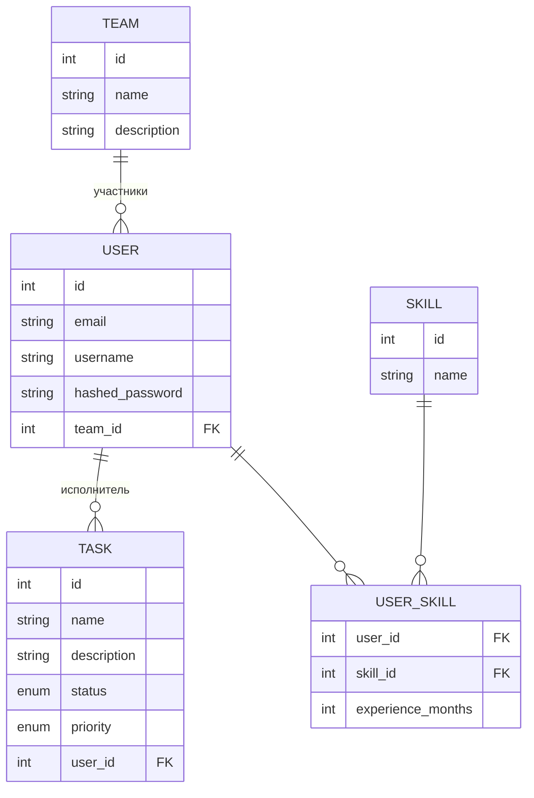

# Task Tracker

Backend часть приложения для управления командами, задачами и навыками сотрудников. Урощённый аналог Jira. Пользователи
объединяются в команды, получают задачи с приоритетом и статусом, а также ведт список своих навыков с опытом работы в каждом из них.

Проект писался как учебный, с упором на чистую архитектуру бэкэнда (роуты - сервисы - репозитории).

## Стек
- **Python 3.12**, **FastAPI**
- **PostgreSQL** + **SQLAlchemy 2.0** (async, `asyncpg`)
- **Alembic** — миграции БД
- **PyJWT (RS256)** + **bcrypt** — аутентификация по JWT в httpOnly-куках
- **Poetry** — управление зависимостями
- **Docker / Docker Compose** — окружение для БД
- **pytest / pytest-asyncio / httpx** — интеграционные тесты на изолированной тестовой БД

## Функционал

**Users** — регистрация, логин/логаут, access + refresh токены, просмотр
своего профиля и профилей других пользователей.
 
**Teams** — создание и редактирование команд, просмотр состава, добавление
и удаление участников.
 
**Tasks** — создание задач, статусы (`created → in_progress → review → done`),
приоритеты (`low / medium / high / critical`), назначение и снятие
исполнителя, просмотр задач конкретного пользователя.
 
**Skills** — справочник навыков: создание, поиск по имени, редактирование, удаление.
 
**User Skills** — привязка навыков к пользователю с указанием опыта в месяцах.

## Структура базы данных (на 19.08.26)

## Архитектура
 
Проект разделён на слои с чёткой ответственностью:
 
- **`api/`** — роуты FastAPI, только приём запроса и вызов сервиса
- **`service/`** — бизнес-логика и обработка ошибок
- **`crud_repositories/`** — прямая работа с БД через SQLAlchemy
- **`schemas/`** — Pydantic-схемы валидации запросов/ответов
- **`db/models/`** — ORM-модели
