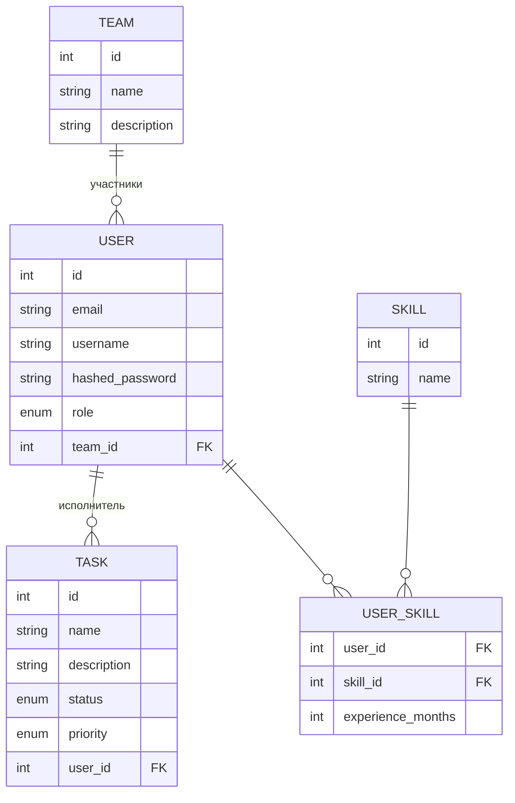

# Pet-project Task Tracker 
 
Backend для трекера задач, упрощённого аналога Jira. Пользователи объединяются в команды, получают задачи со статусом
и приоритетом, ведут список своих навыков с опытом в месяцах.
 
## Стек
 
Python 3.12, FastAPI, PostgreSQL, SQLAlchemy 2.0 (async, asyncpg), Alembic, PyJWT (RS256), bcrypt, Poetry,
Docker Compose, pytest/pytest-asyncio/httpx, GitHub Actions.
 
## Быстрый старт
 
```bash
./setup.sh
poetry run python main.py
```
 
Скрипт поднимает Postgres в Docker, накатывает миграции и создаёт демо-администратора. Swagger — `/docs`.
Логин: `admin` / `admin`. Дальше через `PATCH /users/{id}/role` можно выдавать роли другим пользователям.
 
## Функционал
 
- **Users** — регистрация, логин/логаут по JWT (access + refresh, httpOnly-куки), просмотр профиля
- **Teams** — создание, редактирование, состав команды, добавление/удаление участников
- **Tasks** — статусы (`created → in_progress → review → done`), приоритеты (`low / medium / high / critical`),
  назначение и снятие исполнителя
- **Skills** — справочник навыков (создание, поиск по имени, редактирование, удаление)
- **User Skills** — привязка навыка к пользователю с опытом в месяцах
## Права доступа
 
Роль хранится в `users.role` и проверяется зависимостью `require_role(...)` на уровне роутов.
 
- **`worker`** — доступ только к своим данным: профиль, своя команда (`GET /team/me/team/`), свои навыки
  (`GET /user_skill/me/skills`)
- **`team_lead`** и **`admin`** — полный доступ к командам, задачам, справочнику навыков и назначению навыков
  пользователям; разницы в правах между ними сейчас нет
- Смену роли пользователя (`PATCH /users/{id}/role`) может выполнять только `admin`
Эндпоинта для получения роли admin через API нет — это осознанное решение, такой эндпоинт был бы дырой в
авторизации. Первый администратор создаётся скриптом `scripts/create_admin.py` при разворачивании проекта
(см. `setup.sh`), напрямую в БД, в обход обычного flow регистрации.
 
## Пагинация
 
Списочные эндпоинты (`/users`, `/team`, `/team/{id}/members`, `/task`, `/skill`) принимают `limit` (1–100,
по умолчанию 20) и `offset` и отдают:
 
```json
{
  "items": [],
  "total": 0,
  "limit": 20,
  "offset": 0
}
```
 
## Схема БД
 

 
## Архитектура
 
```
api/                — роуты FastAPI: приём запроса, проверка прав, вызов сервиса
auth/                — JWT (RS256), хэширование паролей, get_current_user, require_role
service/             — бизнес-логика, обработка ошибок
crud_repositories/   — запросы к БД через SQLAlchemy
schemas/             — Pydantic-схемы запросов/ответов
db/models/           — ORM-модели
```
 
## Тесты и CI
 
Интеграционные тесты — на изолированной тестовой БД (`docker-compose up pg_test`), с фикстурами по ролям
(`admin_client` / `team_lead_client` / `worker_client`) для проверки бизнес-логики и RBAC вместе.
GitHub Actions на каждый push/PR в `main` поднимает тестовую Postgres, генерирует JWT-ключи, гоняет
`black --check` и `pytest`.
 
Покрыт тестами пока только модуль `teams`.
 
## В процессе 
 
- Тесты на auth-flow (register/login/refresh), tasks, skills, user_skills
- Docker для самого приложения
- Фильтрация и сортировка в списочных эндпоинтах
- Комментарии и история изменений задачи
- Логирование
