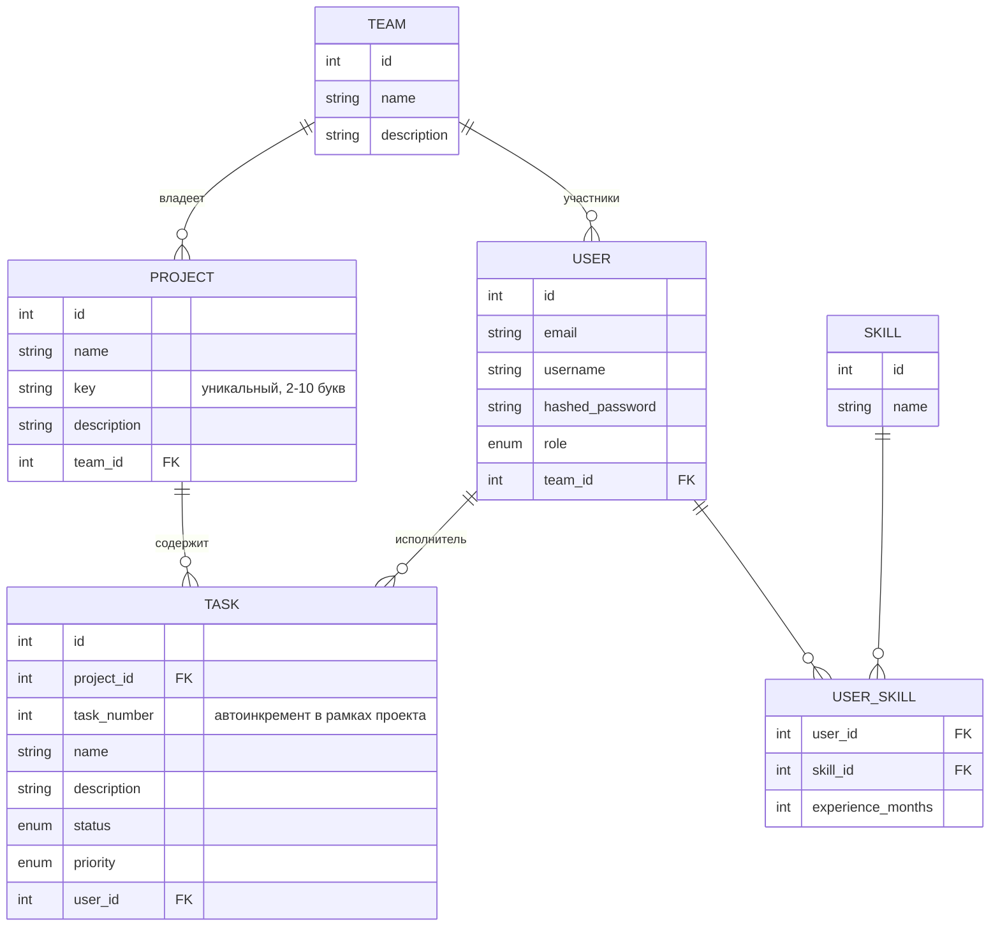

# Pet-project Task Tracker

Backend для трекера задач, упрощённого аналога Jira. Пользователи объединяются в команды, ведут проекты , задачи
получают статус и приоритет, пользователи список навыков с опытом в месяцах.

## Стек

Python 3.12, FastAPI, PostgreSQL, SQLAlchemy 2.0 (async, asyncpg), Alembic, PyJWT (RS256), bcrypt, Poetry, slowapi (rate
limiting), Docker Compose, pytest/pytest-asyncio/httpx, GitHub Actions.

## Быстрый старт

```bash
./setup.sh
poetry run python main.py
```

Скрипт поднимает Postgres в Docker, накатывает миграции и создаёт демо-администратора. Swagger — `/docs`. Логин:
`admin` / `admin`. Дальше через `PATCH /users/{id}/role` можно выдавать роли другим пользователям.

## Функционал

- **Users** — регистрация, логин/логаут по JWT (access + refresh, httpOnly-куки), просмотр и редактирование профиля
- **Teams** — создание, редактирование, состав команды, добавление/удаление участников
- **Projects** — проекты внутри команды, с коротким уникальным `key` (2–10 латинских букв, как `SRB` в Jira)
- **Tasks** — привязаны к проекту, получают человекочитаемый номер вида `{project.key}-{task_number}`
  (например `SRB-42`, счётчик свой в рамках каждого проекта); статусы (`created → in_progress → review → done`),
  приоритеты (`low / medium / high / critical`), назначение и снятие исполнителя
- **Skills** — справочник навыков (создание, поиск по имени, редактирование, удаление)
- **User Skills** — привязка навыка к пользователю с опытом в месяцах

## Права доступа

Роль хранится в `users.role`. Для списочных/административных операций используется грубая проверка
`require_role(...)` на уровне роута, для операций над конкретным ресурсом (получить/изменить/удалить по id) проверяются
функциями владения из `auth/permissions/` (`users.py`, `teams.py`, `projects.py`, `tasks.py`, `user_skills.py`), которые
вызываются в сервисном слое:

- **`admin`** — полный доступ ко всем ресурсам
- **`team_lead`** — доступ только к ресурсам **своей** команды: участники своей команды, проекты своей команды, задачи в
  этих проектах, навыки участников своей команды. Team_lead без назначенной команды не имеет доступа ни к чему за
  пределами своего профиля
- **`worker`** — доступ только к своим данным: профиль, своя команда (`GET /team/me/team/`), свои навыки
  (`GET /user_skill/me/skills`)

Задача принадлежит команде **через проект** (`task.project.team_id`), а не через исполнителя. Team_lead может управлять
задачами своей команды независимо от того, назначен ли на них кто-то. Список "задачи пользователя"
(`GET /task/users/{id}/tasks`) и назначение исполнителя, наоборот, смотрят на команду **самого пользователя**
(`user.team_id`), а не на проект, это осознанно разные проверки, могут иногда расходиться, если исполнителя перевели в
другую команду после назначения.

Смену роли пользователя (`PATCH /users/{id}/role`) может выполнять только `admin`. Эндпоинта для получения роли admin
через API. Первый администратор создаётся скриптом `scripts/create_admin.py` при разворачивании проекта (см.
`setup.sh`), напрямую в БД, в обход обычного flow регистрации.

## Rate limiting

`POST /login` и `POST /register` ограничены `5 запросов/минуту` по IP (`slowapi`), чтобы затруднить брутфорс пароля.

## Пагинация

Списочные эндпоинты (`/users`, `/team`, `/team/{id}/members`, `/project`, `/task`, `/skill`) принимают
`limit` (1–100, по умолчанию 20) и `offset` и отдают:

```json
{
  "items": [],
  "total": 0,
  "limit": 20,
  "offset": 0
}
```

## Схема БД



## Архитектура

api/ — роуты FastAPI: приём запроса, проверка роли, вызов сервиса

auth/ — JWT (RS256), хэширование паролей, get_current_user, require_role

auth/permissions/ — проверки владения ресурсом (can_manage_task, can_view_team и т.п.)

service/ — бизнес-логика, обработка ошибок, вызов permissions

crud_repositories/ — запросы к БД через SQLAlchemy

schemas/ — Pydantic-схемы запросов/ответов

db/models/ — ORM-модели

core/ — конфиг, rate limiting

## Тесты и CI

Интеграционные тесты — на изолированной тестовой БД (`docker-compose up pg_test`), с фикстурами по ролям
(`admin_client` / `team_lead_client` / `worker_client`) для проверки бизнес-логики и RBAC вместе. Каждый модуль с
проверкой владения тестируется по единой сетке: `admin` → любой ресурс, `team_lead` → свой/чужой,
`team_lead` без команды, `worker` → запрещено.

GitHub Actions на каждый push/PR в `main` поднимает тестовую Postgres, генерирует JWT-ключи, гоняет
`black --check` и `pytest`.

Покрыты тестами: `users`, `teams`, `projects`, `tasks`, `user_skills`.

## В процессе

- Тесты на auth-flow (register/login/refresh) и на skills
- Docker для самого приложения (сейчас в compose только Postgres)
- Фильтрация и сортировка в списочных эндпоинтах
- Подзадачи, метки, комментарии и история изменений задачи
- Логирование, метрики
- WebSocket-уведомления